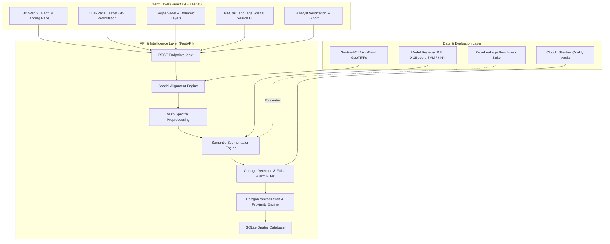

# 🛰️ DRISHTI: AI-Powered Multi-Temporal Satellite Change Intelligence

[](#)
[](#)
[](#)
[](#)
[](#)
[](#)
[](#)
[](#)

> **DRISHTI** (*Defense & Resource Intelligence Satellite Hydrological & Terrestrial Imagery*) is a high-performance, air-gapped Earth Observation (EO) intelligence platform engineered for automated multi-temporal satellite change detection, land-cover evolution tracking, and semantic spatial search across critical defense and ecological corridors.

---

## 📌 Table of Contents

- [Executive Summary](#-executive-summary)
- [System Architecture](#-system-architecture)
- [Key Features](#-key-features)
- [Algorithmic Pipeline](#-algorithmic-pipeline)
- [Satellite Data & Geographic Coverage](#-satellite-data--geographic-coverage)
- [Multi-Classifier Benchmark (V2)](#-multi-classifier-benchmark-v2)
- [Repository Structure](#-repository-structure)
- [Quick Start Guide](#-quick-start-guide)
  - [Prerequisites](#prerequisites)
  - [1. Backend Setup](#1-backend-setup)
  - [2. Frontend Setup](#2-frontend-setup)
  - [3. Running Benchmarks & Verification](#3-running-benchmarks--verification)
- [REST API Reference](#-rest-api-reference)
- [Export Formats & Tactical Intelligence](#-export-formats--tactical-intelligence)
- [License & Provenance](#-license--provenance)

---

## 🌍 Executive Summary

Rapid environmental transitions, unauthorized infrastructure expansion, strategic river channel migration, and deforestation require continuous monitoring. Conventional manual satellite photo-interpretation is slow, labor-intensive, and prone to false alarms caused by cloud shadows, illumination differences, and sensor misalignment.

**DRISHTI** delivers an automated, **100% offline edge-capable intelligence stack** that:
1. Ingests calibrated multi-band **Sentinel-2 Level-2A Bottom-of-Atmosphere (BOA)** imagery.
2. Performs sub-pixel geodetic alignment using **OpenCV ORB feature extraction and RANSAC homography**.
3. Classifies landscapes into 5 discrete land-cover categories using multi-spectral feature vectors $[R, G, B, \text{NIR}, \text{NDVI}, \text{NDWI}]$.
4. Detects significant multi-temporal transitions while suppressing false alarms (cloud/shadow masking, morphological structuring, minimum spatial area thresholds).
5. Vectorizes change clusters into GeoJSON polygons with precise real-world metrics (area in $\text{m}^2$, distance to roads, distance to waterways).
6. Provides an interactive **Leaflet WebGIS workstation** with swipe-slider comparison, natural language spatial query search, and automated dossier exports (GeoJSON, CSV, JSON).

---

## 🏗️ System Architecture



---

## 🚀 Key Features

- **100% Air-Gapped / Offline**: Runs completely on local hardware without cloud dependencies, external tile servers, or telemetry.
- **Sub-Pixel Spatial Co-Registration**: Resolves orbital drifts and multi-temporal vantage variances through `rasterio` CRS reprojection and sub-pixel ORB homography warping.
- **Multi-Spectral Feature Fusion**: Combines visible Red, Green, Blue, and Near-Infrared (NIR) bands with calculated bio-physical indices:
  - **NDVI** (Normalized Difference Vegetation Index) for canopy and biomass tracking.
  - **NDWI** (Normalized Difference Water Index) for water bodies and flood basin tracking.
- **5-Class Land Cover Understanding**:
  - `0`: Bare Land (soil, sandbars, unpaved terrain)
  - `1`: Vegetation (dense forest, shrubs, cropland)
  - `2`: Water (rivers, lakes, wetlands)
  - `3`: Road (asphalt, concrete highways, runways)
  - `4`: Building (urban core, military complexes, roof structures)
- **4 Actionable Change Alert Categories**:
  - 🌲 **Vegetation Loss / Forest Clearing**: Tracks illegal logging, canopy degradation, and encroachment.
  - 🌊 **Water Extent Shift / River Basin**: Tracks channel erosion, flooding, and wetland dynamics.
  - 🏢 **New Construction / Urban Expansion**: Detects new built-up footprints, settlements, and facilities.
  - 🛣️ **Road Change / Transport Corridors**: Detects new transport links and earthworks.
- **Robust False-Alarm Rejection**: Eliminates spurious alerts through cloud/shadow masking, morphological noise filters ($3 \times 3$ rect structuring), and minimum area filtering ($< 20\text{ pixels}$ / $< 200\text{ m}^2$).
- **Natural Language Spatial Search**: Search change events with semantic criteria and spatial proximity constraints (e.g., *"new construction within 500m of roads"* or *"deforestation near water"*).
- **Interactive Leaflet Workstation**: Synchronized side-by-side view, transparency swipe curtain, toggleable segmentation overlays, vector inspection drawer, and confidence scoring.
- **Multi-Format Tactical Exports**: Instant export of verified intelligence into **GeoJSON FeatureCollections**, **CSV spreadsheets**, and **structured JSON reports**.

---

## 🔬 Algorithmic Pipeline

### 1. Geospatial Alignment & Sub-Pixel Registration
```python
# Automatic CRS Reprojection to EPSG:4326 + Feature-Based Homography
aligned_tgt, transform = align_geospatial(ref_scene, tgt_scene, mask_scene)
```
- Reprojects the target image onto the reference grid using standard geospatial resampling.
- Extracts ORB (Oriented FAST and Rotated BRIEF) keypoints across stationary structural landmarks.
- Computes RANSAC homography matrix $H$ to correct residual sub-pixel camera and terrain misregistrations.

### 2. Multi-Spectral Preprocessing & Feature Extraction
Normalizes 4-band BOA surface reflectance values to $[0.0, 1.0]$ and computes physical spectral indices per pixel:
$$\text{NDVI} = \frac{\text{NIR} - \text{Red}}{\text{NIR} + \text{Red} + 10^{-5}}, \quad \text{NDWI} = \frac{\text{Green} - \text{NIR}}{\text{Green} + \text{NIR} + 10^{-5}}$$
Every classifier processes a standardized 6-dimensional feature vector:
$$\mathbf{x} = [R, G, B, \text{NIR}, \text{NDVI}, \text{NDWI}]$$

### 3. Transition Matrix & Change Extraction
Given classification maps $S_{\text{before}}$ and $S_{\text{after}}$, valid changes are mapped through a deterministic transition matrix:
- $\text{Vegetation (1)} \rightarrow \text{Bare (0)} \implies \textbf{VEGETATION LOSS}$
- $\text{Bare (0)} \rightarrow \text{Building (4)} \lor \text{Vegetation (1)} \rightarrow \text{Building (4)} \implies \textbf{NEW CONSTRUCTION}$
- $\text{Water (2)} \leftrightarrow \text{Bare (0)} \implies \textbf{WATER EXTENT CHANGE}$
- $\text{Bare (0)} \lor \text{Vegetation (1)} \rightarrow \text{Road (3)} \implies \textbf{ROAD CHANGE}$

### 4. Vectorization & Proximity Analytics
- Contours are converted to Shapely polygons with affine coordinate transformations to WGS-84 (`EPSG:4326`).
- Computes real-world metrics:
  - Surface area ($m^2$ and $km^2$)
  - Geodetic centroid ($\text{Latitude}, \text{Longitude}$)
  - Euclidean distance to the nearest classified transport road ($m$)
  - Euclidean distance to the nearest water body ($m$)

---

## 🛰️ Satellite Data & Geographic Coverage

All demonstration and evaluation datasets are derived from calibrated **Copernicus Sentinel-2 MSI Level-2A** products:

| Strategic AOI Location | Primary Focus | Baseline Observation | Target Observation | Resolution | Coordinates (Center) |
|---|---|---|---|---|---|
| **🌲 Kaziranga / Garbhanga Reserve** | Forest Canopy & Deforestation | `2024-02-10` | `2026-03-06` | $10\text{ m/px}$ | $26.1624^\circ\text{ N}, 91.7422^\circ\text{ E}$ |
| **🌊 Brahmaputra / Majuli River Basin** | Braided Channel & Sandbars | `2023-01-21` | `2026-03-06` | $10\text{ m/px}$ | $26.1842^\circ\text{ N}, 91.7503^\circ\text{ E}$ |
| **🏢 Guwahati Urban Core** | Infrastructure & Built-Up Growth | `2024-02-10` | `2026-03-06` | $10\text{ m/px}$ | $26.1644^\circ\text{ N}, 91.7590^\circ\text{ E}$ |
| **🌍 Mixed Landscape Corridor** | Multi-Class Regional Corridor | `2024-03-11` | `2026-03-06` | $10\text{ m/px}$ | $26.1725^\circ\text{ N}, 91.7499^\circ\text{ E}$ |
| **🌿 Deepor Beel Ramsar Wetland** | Wetland Hydrology & Macrophytes | `2024-02-10` | `2025-02-09` | $10\text{ m/px}$ | $26.1731^\circ\text{ N}, 91.7392^\circ\text{ E}$ |
| **🎓 VIT-AP Campus (Amaravati)** | Multi-Year Campus Construction | `2021-03-06` | `2026-03-05` | $10\text{ m/px}$ | $16.4971^\circ\text{ N}, 80.5002^\circ\text{ E}$ |

---

## 📊 Multi-Classifier Benchmark (V2)

The system includes a rigorous benchmarking framework (`eval/v2/`) comparing four distinct classification architectures on **786,432 held-out test pixels** across spatially and ecologically disjoint regions (> 1,500 km geographic separation):

```
       Identical 6-Band Feature Vector [R, G, B, NIR, NDVI, NDWI]
                                   ↓
        ┌─────────────┬─────────────┬─────────────┬─────────────┐
        │Random Forest│   XGBoost   │     SVM     │     KNN     │
        └─────────────┴─────────────┴─────────────┴─────────────┘
                                   ↓
                     HELD-OUT TEST EVALUATION
        (Amaravati AP Scene + Brahmaputra Western Channel Scene)
                                   ↓
             Overall Accuracy, Macro F1, mIoU, Confusion Matrix
```

- **Strict Zero-Leakage Guarantee**: Evaluated via `eval/v2/leakage_check.py`. Train and test splits have **0.00% spatial overlap**.
- **Standardized Preprocessing**: Feature scalers are fit strictly on training splits.
- **Two Evaluation Tracks**:
  - **Track A (Weak-Label Benchmark)**: Measures agreement with physical spectral threshold rules across millions of pixels.
  - **Track B (Annotated Ground Truth)**: Direct validation against hand-annotated polygon ground truth.

---

## 📂 Repository Structure

```
SIH_2026/
├── backend/                        # FastAPI Core Service
│   ├── main.py                     # API application, routing & lifecycle
│   ├── database.py                 # SQLite persistence for scenes and changes
│   ├── change/
│   │   └── change_detection.py     # Transition mapping, morphology & vectorization
│   ├── gis/
│   │   └── alignment.py            # GeoTIFF reprojection & sub-pixel ORB homography
│   ├── ingest/
│   │   └── preprocessing.py        # Normalization, band extraction & NDVI/NDWI
│   ├── models/
│   │   ├── segmentation.py         # Production Random Forest semantic segmenter
│   │   └── v2/                     # Multi-model evaluation suite (XGBoost, SVM, KNN)
│   └── search/
│       └── search.py               # Natural language & spatial proximity search
├── frontend/                       # React 19 + Vite WebGIS Application
│   ├── src/
│   │   ├── App.jsx                 # Dual-pane Leaflet GIS workstation & swipe view
│   │   ├── LandingPage.jsx         # Starfield canvas & 3D WebGL Earth interface
│   │   ├── App.css                 # Workstation layout styling
│   │   └── index.css               # Design system, themes & animations
│   └── package.json                # Frontend dependencies & scripts
├── data/
│   ├── locations/                  # Pre-staged AOI indices & configuration
│   ├── v2/                         # Standardized Sentinel-2 multi-scene dataset
│   │   ├── metadata/               # Scene catalog & coordinate bounding boxes
│   │   └── splits/                 # Disjoint train / validation / test splits
│   └── generate_data.py            # Offline synthetic benchmark generator
├── docs/                           # Technical Specifications & Documentation
│   ├── architecture.md             # System architecture & pipeline diagram
│   ├── setup.md                    # Environment setup & installation guide
│   └── provenance.md               # Georeferencing, licensing & benchmark metrics
├── eval/                           # Scientific Evaluation & Verification
│   ├── eval.py                     # Legacy pipeline precision/recall benchmark
│   └── v2/                         # V2 scientific benchmarking suite
│       ├── benchmark.py            # 4-classifier comparison benchmark runner
│       ├── leakage_check.py        # Data leakage & spatial disjointness validator
│       ├── metrics.py              # Macro F1, mIoU, and per-class calculations
│       └── scene_evaluation.py     # Cross-geographic generalization testing
├── requirements.txt                # Python backend dependencies
└── README.md                       # Master project documentation
```

---

## ⚡ Quick Start Guide

### Prerequisites
- **Python**: Version 3.10 or higher
- **Node.js**: Version 18 or higher (with `npm`)
- **Memory**: 8 GB RAM recommended (16 GB for full multi-scene training)

---

### 1. Backend Setup

1. **Create and activate a virtual environment**:
   ```bash
   # Windows (PowerShell)
   python -m venv venv
   .\venv\Scripts\Activate.ps1

   # Linux / macOS
   python3 -m venv venv
   source venv/bin/activate
   ```

2. **Install dependencies**:
   ```bash
   pip install -r requirements.txt
   ```

3. **Start the FastAPI server**:
   ```bash
   python backend/main.py
   ```
   - The API will be live at: **`http://127.0.0.1:8000`**
   - Interactive Swagger docs: **`http://127.0.0.1:8000/docs`**

---

### 2. Frontend Setup

1. **Navigate to the frontend directory**:
   ```bash
   cd frontend
   ```

2. **Install Node packages**:
   ```bash
   npm install
   ```

3. **Start the development server**:
   ```bash
   npm run dev
   ```
   - The WebGIS dashboard will be live at: **`http://localhost:5173`**

---

### 3. Running Benchmarks & Verification

To verify the pipeline and run automated checks:

```bash
# 1. Test all 5 AOI locations and API endpoints:
python test_all_locations.py

# 2. Verify zero spatial and temporal data leakage:
python eval/v2/leakage_check.py

# 3. Run full multi-classifier benchmark (RF vs XGBoost vs SVM vs KNN):
python eval/v2/benchmark.py --max-train-samples 100000

# 4. Evaluate cross-geographic generalization across scenes:
python eval/v2/scene_evaluation.py
```

---

## 📡 REST API Reference

| Method | Endpoint | Description |
|---|---|---|
| `GET` | `/health` | Service health status, offline status, and engine information. |
| `GET` | `/locations` | Retrieves all registered demonstration AOIs with metadata and scene IDs. |
| `GET` | `/scenes?location={id}` | Lists available multi-temporal satellite scenes for a given location. |
| `POST` | `/change-detect` | Executes alignment, segmentation, and change extraction for a pair of scenes. |
| `GET` | `/changes?location={id}` | Fetches detected change polygons and properties from the spatial database. |
| `POST` | `/search?query={text}&location={id}` | Natural language and spatial proximity query search over detected changes. |
| `GET` | `/export?format={geojson\|csv\|json}&location={id}` | Exports verified change intelligence reports in GeoJSON, CSV, or JSON. |

---

## 🛡️ Export Formats & Tactical Intelligence

The platform allows one-click export of tactical dossiers:

### 1. GeoJSON (`/export?format=geojson`)
Standard OGC compliant FeatureCollection with exact WGS84 polygon geometries, confidence scores, classified change type, area in $m^2$, and distance to transport infrastructure:
```json
{
  "type": "FeatureCollection",
  "name": "Antigravity_Change_Intelligence_Export_forest",
  "crs": { "type": "name", "properties": { "name": "urn:ogc:def:crs:OGC:1.3:CRS84" } },
  "features": [
    {
      "type": "Feature",
      "properties": {
        "id": "change_003",
        "type": "VEGETATION LOSS",
        "confidence": 0.94,
        "area_sqm": 42100.0,
        "distance_to_road_m": 85.4,
        "distance_to_water_m": 340.2,
        "dates": ["2024-02-10", "2026-03-06"]
      },
      "geometry": { "type": "Polygon", "coordinates": [...] }
    }
  ]
}
```

### 2. Tabular CSV (`/export?format=csv`)
Structured spreadsheet format for GIS tables and legacy military command systems:
```csv
ID,Location,Change_Type,Confidence_Score,Area_Sqm,Area_Pixels,Centroid_Lat,Centroid_Lon,Dist_Road_Meters,Dist_Water_Meters,Dates,Explanation
change_003,forest,VEGETATION LOSS,0.94,42100.0,421,26.1642,91.7481,85.4,340.2,2024-02-10 -> 2026-03-06,Vegetation to Bare transition
```

---

## 📜 License & Provenance

- **Satellite Data**: Contains modified Copernicus Sentinel-2 data (2021–2026), processed under the **Creative Commons Attribution 4.0 International (CC-BY 4.0)** license.
- **Codebase**: Developed for the **Smart India Hackathon (SIH 2026)**.
- **Air-Gapped Guarantee**: Engineered to operate strictly in sovereign, local edge environments without external transmission.
